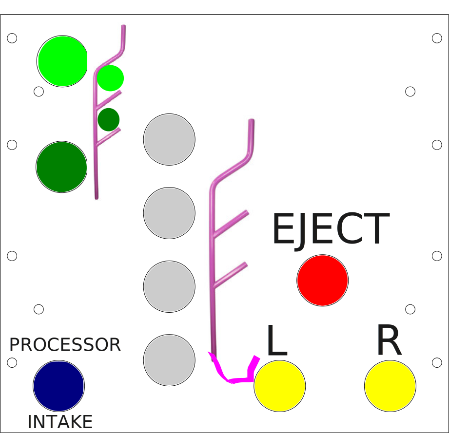

# Controller Layout

## Driver 1

|Input|Action|
|-|-|
|Left Stick X|Strafe|
|Left Stick Y|Forward/Backward|
|Right Stick X|Rotate|
|Right Trigger Pressed|Deposit Coral|

>NOTE: The main driver controls the coral deposit as they know when the robot is properly lined up

## Driver 2

Driver 2 uses a button box module to control the manipulator.
